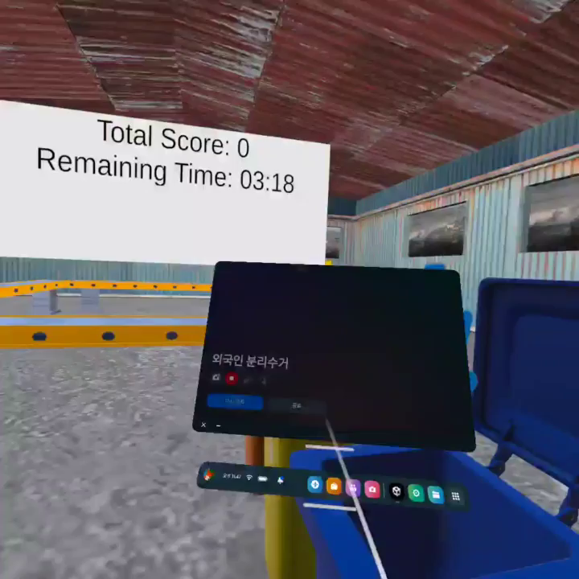
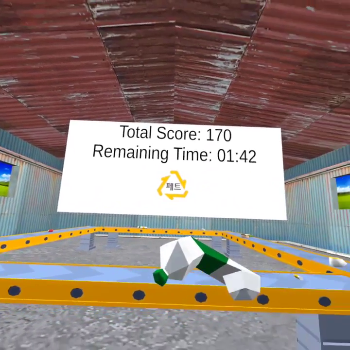
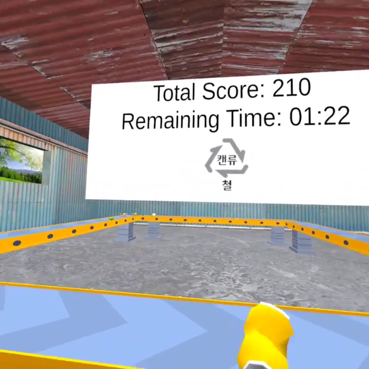
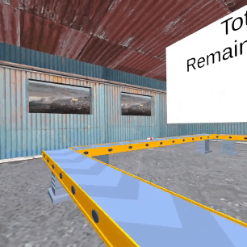
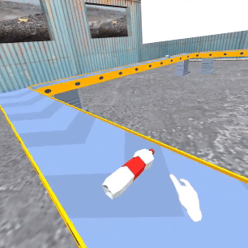

# 가상현실 프로젝트 - Recycle Master

 

## 프로젝트 목표
분리수거 체험 시뮬레이션을 통해 사용자는 분리수거 공장의 노동자가 되어 분리수거 체험 활동을 진행합니다.   

이를 통해, 우리나라 분리수거 방식이 익숙하지 않은 외국인들에게 효과적으로 학습을 진행하면서 분리수거를 하지 않았을 때와 환경 파괴와의 연관성을 시각적으로 경험하게 하여 동기를 부여합니다.   

 

## 맴버구성
- 팀장 : 장윤석([@dodogcat](https://github.com/dodogcat)) - 기획 보조, 오큘러스 VR 에셋 적용 및 테스트, 도구를 통한 쓰레기와의 상호작용할 오브젝트 선택 스크립트, 착용 도구 변경 스크립트, 최종 보고서 작성

- 팀원 : 채진우([@Shyplants](https://github.com/Shyplants)) - 유니티 클라이언트 개발(컨베이어 벨트, 쓰레기통 등 오브젝트 배치 및 스크립트 작성, 타이머와 스코어 등 게임로직 작성)

- 팀원 : 이민정([@PlppIle](https://github.com/PlppIle)) - 기획, 프로젝트 자료 조사 및 에셋 탐색, 배경 오브젝트 배치, 최종 보고서 작성

- 팀원 : 전효재([@C4NU](https://github.com/C4NU)) - 프로젝트 계획서 자료 조사, 에셋 탐색 및 오디오 파일 탐색, 게임 오디오 효과음 스크립트 작성

 

## 개발 기간
* 23.03.21 - 23.06.08

 

## 플레이 화면
||
|:--:|
|**1) 시작화면**|

 

|||
|:--:|:--:|
|**2) 페트병을 집었을 때**|**3) 캔을 집었을 때**|

 

|||
|:--:|:--:|
|**4) 컨베이어 벨트**|**5) 인터렉티브**|

 

## 사용 에셋목록
- Low Poly Recycling Pack : https://assetstore.unity.com/packages/3d/props/low-poly-recycling-pack-217509

- LowPoly Factory Machine Pack : https://assetstore.unity.com/packages/3d/props/industrial/lowpoly-factory-machine-pack-242586

- Oculus Integration : https://assetstore.unity.com/packages/tools/integration/oculus-integration-82022

- Conveyer Belt Sound Effect : https://sound-effects.bbcrewind.co.uk/search?q=07061072
